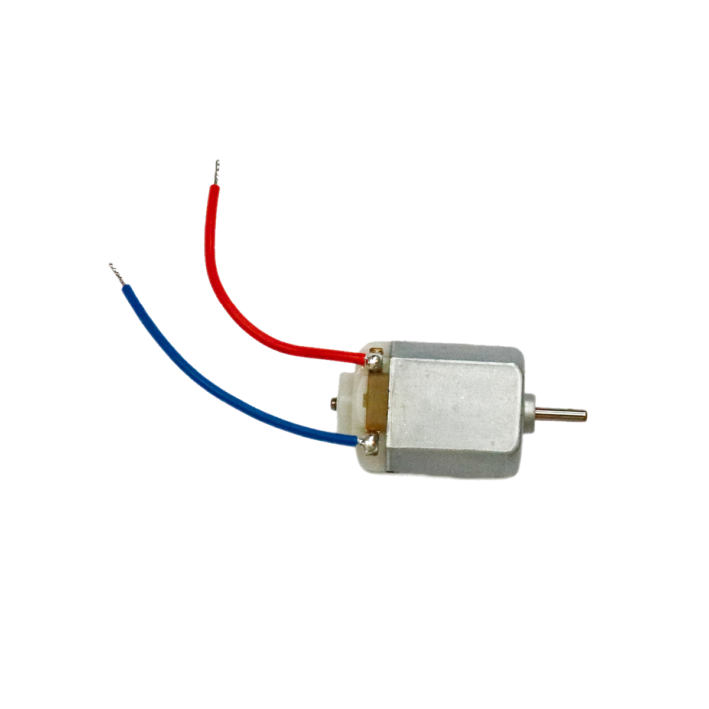

# Gleichstrommotor

## Beschreibung

Ein Gleichstrommotor (auch Direct-Current-Motor genannt) dreht solange, wie er an einer Spannungsquelle hängt und kann sich so theoretisch unendlich weiterdrehen. 

<!-- more_details -->

Die tatsächliche Drehung ist auch von der Kraft abhängig, die er aufbringen muss, um etwas in Bewegung zu bringen. 
Seine genaue Positionierung ist daher ohne Sensoren nicht möglich. 
Wird ein DC-Motor stark belastet, dreht er sich deutlich langsamer.

Die Steuerung erfolgt über ein einfaches Relais, einen Transistor, einen manuellen Schalter oder einen Motortreiber, der als fertiges Modul zwischen Mikrocontroller und Gleichstrommotor geschaltet wird.

Alle weiteren Hintergrundinformationen, sowie ein Beispielaufbau und alle notwendigen Programmbibliotheken findet man über alle gängigen Suchmaschinen durch die Eingabe der genauen Komponentenbezeichnungen. 
Das wichtige Stichwort lautet hier „DC Motor“ oder „Gleichstrommotor“.

## Beispiele

!!!show-examples:./examples/

<!-- infolists -->

@[youtube](https://www.youtube.com/watch?v=wVxcmO2YuxA)

## Wichtige Links für die ersten Schritte:

- [Adafruit Gleichstrommotor](https://www.adafruit.com/product/711)
- [Seeed Studio Wiki – Motortreiber](http://wiki.seeedstudio.com/Grove-I2C_Motor_Driver_V1.3/)

## Projektbeispiele:

- [Arduino-Tutorial - DC Motor Steuerung](https://www.arduino-tutorial.de/motorsteuerung-direkt-per-arduino/)

## Weiterführende Hintergrundinformationen:

- [GPIO - Wikipedia Artikel](https://de.wikipedia.org/wiki/Allzweckeingabe/-ausgabe)
- [Gleichstrommotor - Wikipedia Artikel](https://de.wikipedia.org/wiki/Gleichstrommaschine)
